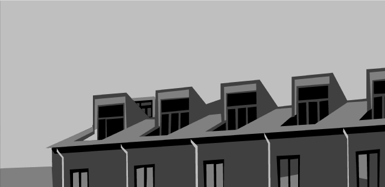

# *A Series of Gunshots*

# [Play Online](https://www.pippinbarr.com/a-series-of-gunshots/) (desktop)

## Description
*A series of gunshots.*

_A Series of Gunshots_ was written in JavaScript/HTML5 using the [Phaser](http://phaser.io/) game framework. Sounds were created using [Gibber](http://charlie-roberts.com/gibber/).

## Documentation
* Read the [Process Documentation](../process)
* Look at the [Code Repository](https://github.com/pippinbarr/a-series-of-gunshots) for source code etc.

## Press
Read the [Press Kit](../press) for press information

* [Kill Screen](https://killscreen.com/articles/a-series-of-gunshots-calls-out-senseless-gun-violence-in-games)
* [Offworld](http://boingboing.net/2015/11/19/a-series-of-gunshots.html)
* [Molleindustria](http://www.molleindustria.org/blog/top-ten-2015-games-you-dont-have-to-play/)
* [Matajuegos](http://mata.juegos/en/2016/07/minimal-input-games-and-the-exploration-of-juice/)
* [Haywire Magazine](http://www.haywiremag.com/columns/opened-world-framing-violence/)

## License
*A Series of Gunshots* is licensed under a [Creative Commons Attribution-NonCommercial 3.0 Unported License](http://creativecommons.org/licenses/by-nc/3.0/).
