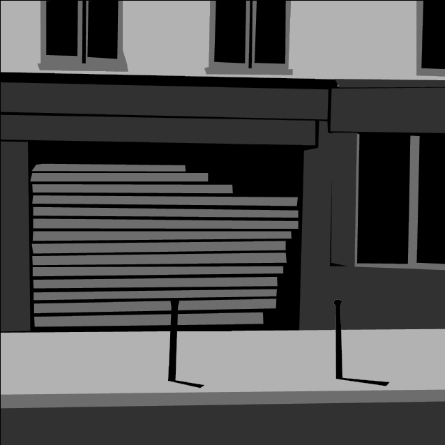
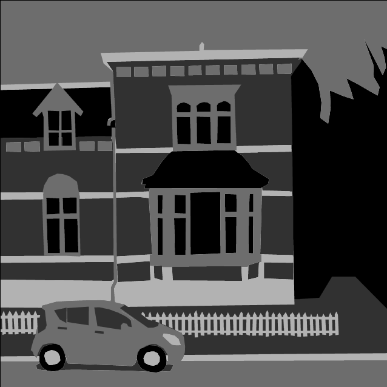
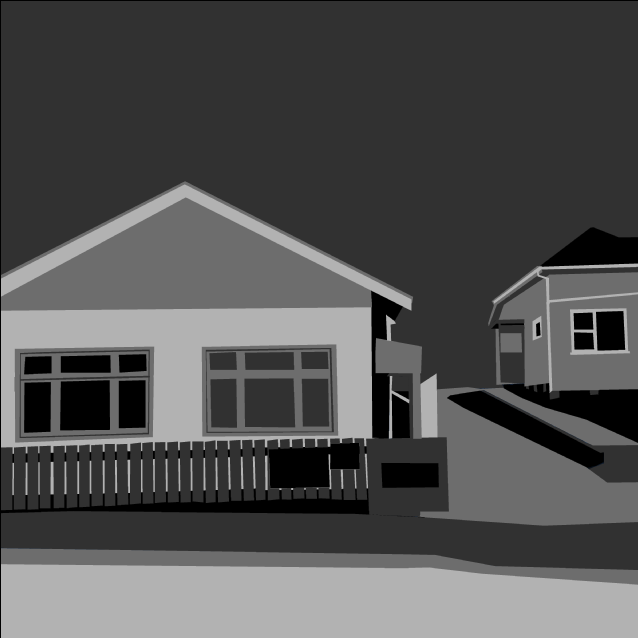
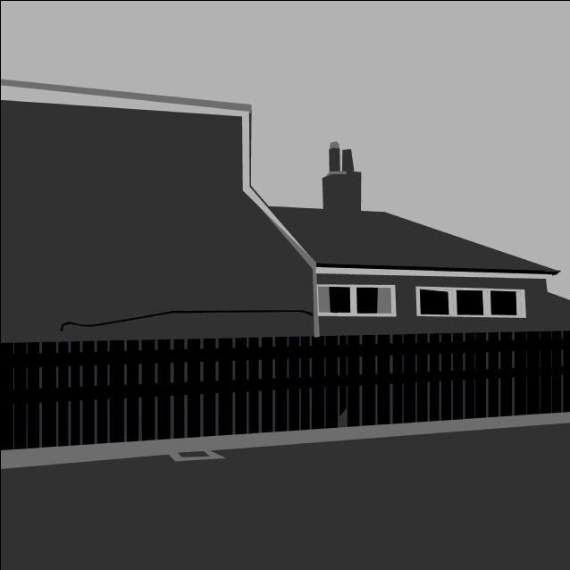
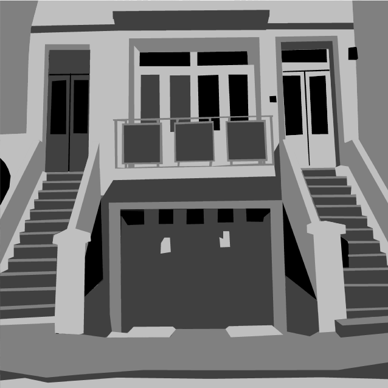
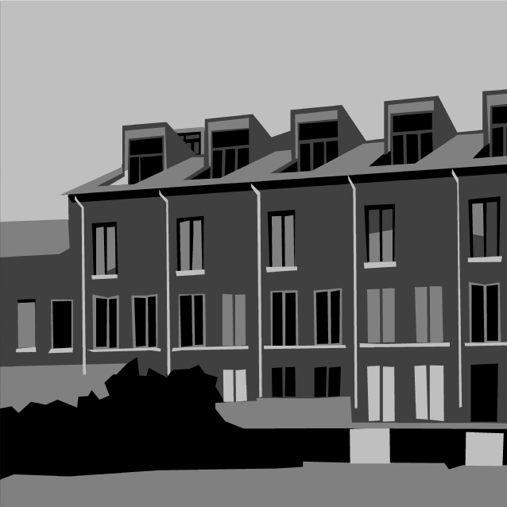

# *A Series of Gunshots*

## Information
* Released: 19 November 2015
* Website: http://www.pippinbarr.com/
* Platforms: Browser
* Link: https://www.pippinbarr.com/a-series-of-gunshots/info
* Price: Free.

## Description
A series of gunshots.

## History
A Series of Gunshots is a game developed in part as a continuation of the aesthetic and tone of its predecessor What We Did. A Series of Gunshots is intended to be yet more minimalist than What We Did and is entirely focused on the question of gun violence in daily life and most especially its representation (and general glorification or enjoyment) in videogames. Attempting to create a game that could make gun violence appear and feel as awful as it is in reality was paradoxically difficult. It isn't necessarily clear this game succeeds at it. But it is an attempt, and it is something that needs to be tried again and again.

## Features
* A
* Series
* Of
* Gunshots

## Images

## Trailer
[View the Trailer on YouTube](https://www.youtube.com/watch?v=21GCoJLj2I8)

## Credits
* Pippin Barr: Design, graphics, sound
* Rilla Khaled: Design
