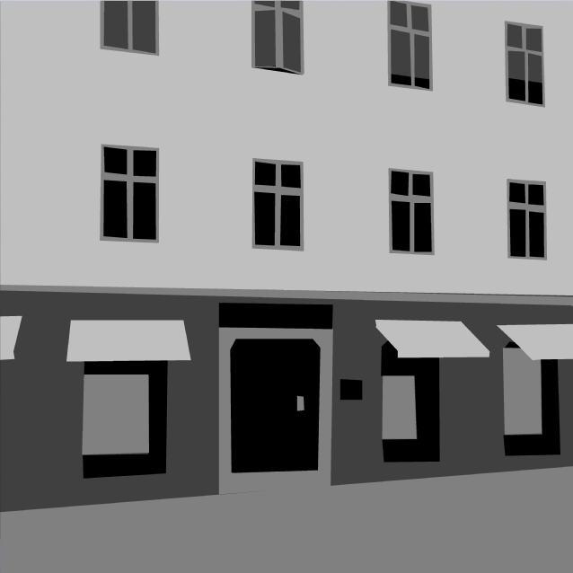

# Blog Posts

Here are public-facing blog posts I wrote about the game.

## A Series of Shots in the Dark (2015-10-26)

I'm working on a new game post-_[BREAKSOUT](http://www.pippinbarr.com/games/breaksout)_. Actually I started work on it the day after that game released, but I'm still adjusting to the extremes of teaching two university courses (in three sessions), being part of the extraordinarily vibrant research community at Concordia (notably at [TAG](http://tag.hexagram.ca/)), getting our apartment settled, applying for a job, and on and on. I'm still working on this thing, but at a snail's pace, not at all &#8216;like a shot'.

The new game is called _A Series of Gunshots_ and it is about a series of gunshots. And it's in collaboration with Rilla. The gist of it is as follows. The game fades in on a static scene (ala _[What We Did](http://www.pippinbarr.com/games/whatwedid/)_), eventually you hit a key, a gunshot goes off with a flash in a window (or somewhere else such that you don't see what happened), then you may be able to trigger another gunshot with a keypress (up to three), then the scene fades out and is replaced by a new scene, repeat. This happens give times, then it's over and fades to a black screen. Pretty straightforward. Here are some thoughts:

**Why?** Well I found the ending of _What We Did_ one of the more evocative and profound moments I've ever had the fortune to help produce in a game. I found it chilling in all the right ways, and I wanted to expand on some of the &#8216;feels' that that moment possesses while also abstracting the idea of &#8216;who' and &#8216;why' more fully into the realms of player interpretation.

**Why five scenes?** Mostly intuition. I should note that although you see five scenes in any one playing, there will be more scenes (visually) than that and they'll be selected down to five randomly at the start of the game. I want a sense of repetition and inevitability without it drawing out forever, five seems like a good number. (This reminds me of the discussion of how many times to say &#8216;the crew compartment's breaking up' in the [Sound Exploder episode](http://songexploder.net/the-long-winters) on The Long Winters' &#8216;The Captain Thinks Aloud'.)

**Why just any key? And what about the mouse?** I had a build that included a mouse click to trigger the shots as well, but it quickly became obvious that that has too much implied directed agency (you click somewhere specific) which messes with the &#8216;involved and not involved' feeling I want the game to have. The fact it's any keypress (again, not, like the spacebar only to avoid the sense of having a specific agency, a trigger) makes your involvement both critical (it's the only thing that makes the gun go off) and abstracted/distant.

**Why can't you see the shooting?** Well, you can &#8211; you see a flash in a window (or conceivably in an alley or a car, say), but you can't see the people or the gun or ragdoll physics or any other details. That's for two main reasons. The big one is I'm aiming for player interpretation and imagination within this highly constrained and minimalist interaction, so the less seen the better. The other one is that to the extent this game is &#8216;about' shooting in games (and in life) I want to avoid any sense of &#8216;rewarding' the action with visuals, physics, etc.

**So this is about &#8216;shooting in games'?** Yeah. I've done lots of shooting in games and I'm not judging you (or trying not to), but I think I'm at a point where I find it really gross. (Not to say I won't then end up playing another one and enjoying it.) Anyway, it's complicated, but I felt like making something that would try to bring some of the heaviness I feel about gun violence into a videogame space, how uncool and scary the act of shooting is. Which is not unconnected with how terrifying it is how many shootings are going on in the world as I type this or you read it.

**Not much of an ending?** No, the whole ending on a fade to black thing isn't 100% settled yet, but probably close to it. It's really weird and hard to make this game such that it feels like something but also assiduously avoids any sense of game-ness on the one hand (rewards for shooting etc.) and also any high and mighty moralising on the other. It feels like anything I would put at the end would tip it one way or another, so &#8216;nothing' seems best.

That's it. Look! I wrote about a thing. I'd say I'll write more this week but I probably won't! But maybe I will! But I probably won't.
